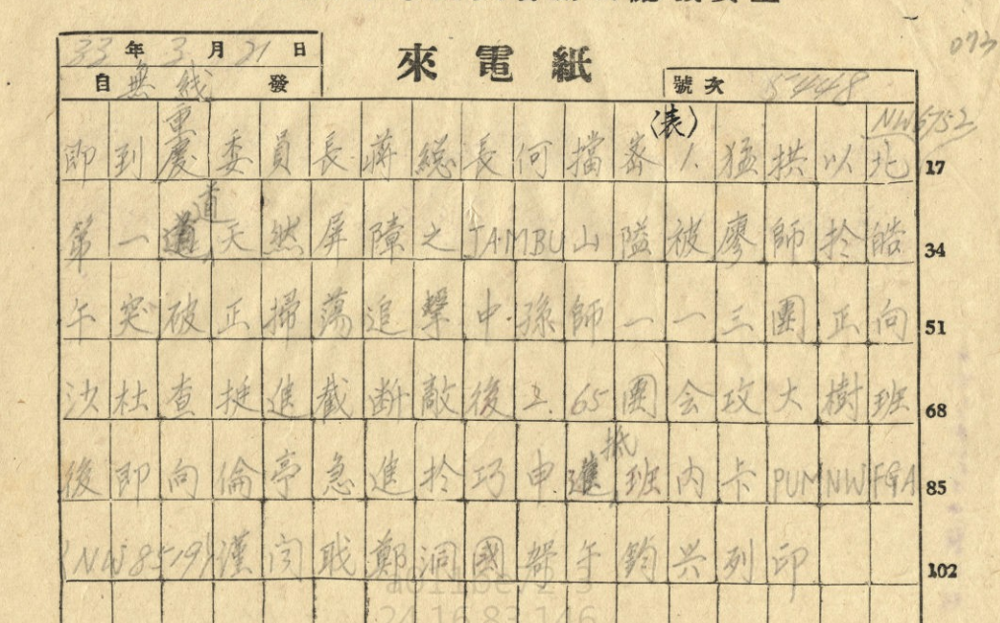

即到、重庆。委员长蒋、总长何：挡密（表）。

1. 猛拱以北NW6752第一道天然屏障之Jambu山隘，被廖师于皓午突被，正扫荡追击中。孙师一一三团正向沙杜查挺进，截断敌后。
2. 六五团会攻大树班后，即向伦亭急进，于巧申进抵班内卡（Pumnwfga）（NW8519）。

谨闻。职郑洞国，哿午。钧兴列印。

> 录入校对：观棋不语

> 选自秦孝仪等:《中华民国重要史料初编——对日抗战时期·第二编:作战经过（五）》，第439页，中国国民党中央委员会党史委员会出版，1981年版。

> 其他来源：国史馆 [*原档链接：鄭洞國電蔣中正何應欽報告廖耀湘突破Jambu山隘掃蕩追擊中及孫立人一一三團向沙杜查挺進截斷敵後等情*](https://ahonline.drnh.gov.tw/index.php?act=Display/image/6018463lBkfpvZ#cdu)

