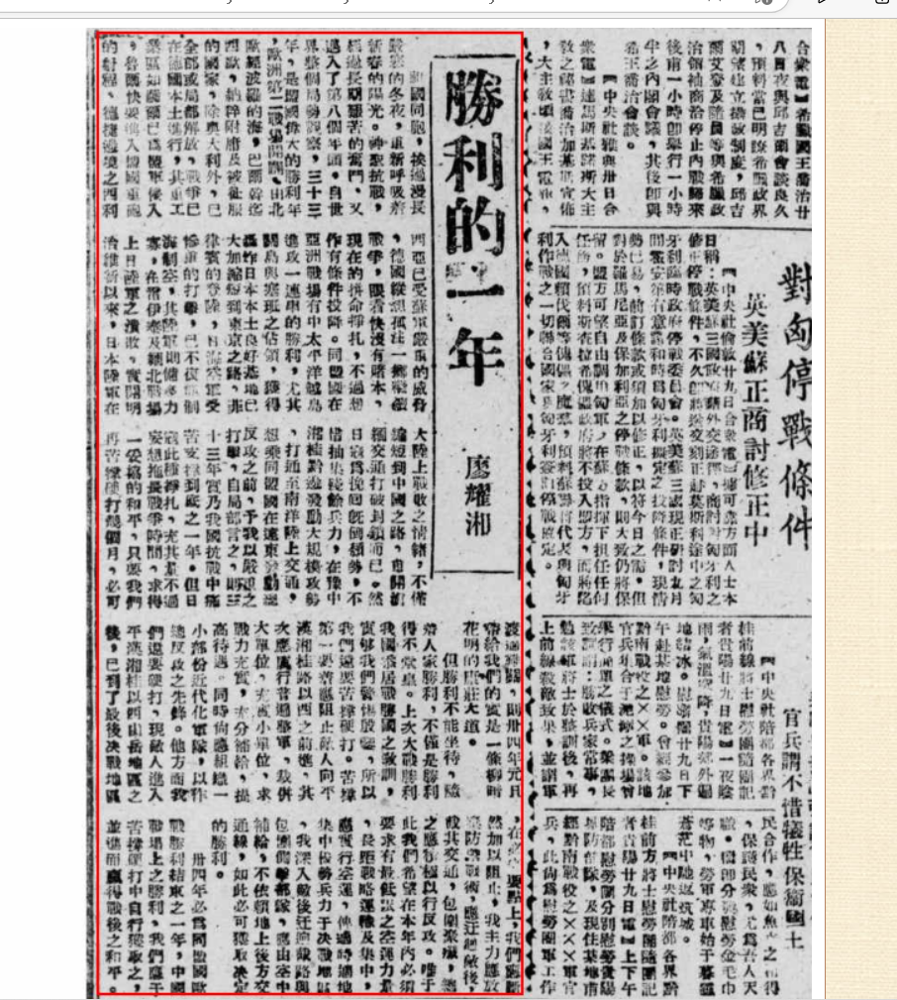

祖国同胞，挨过漫长严寒的冬夜，重新呼吸着新春的阳光。神圣抗战，经过长期艰苦的奋斗，又迈入了第八个年头。自世界整个局势观察，三十三年，是同盟国伟大的胜利年，欧洲第二战场开辟，由北欧经波罗的海，巴尔干迄西欧，纳粹附庸及被征服的国家，除奥大利外，已全部或局部解放，战争已在德国本土进行，其重工业区如萨尔已为盟军侵入，鲁尔快要进入盟国重炮的射程、德捷边境之西利西亚已受苏军严重的威胁，德国纵想孤注一掷继续战争，眼看快没有赌本，现在的拼命挣扎，不过想作有条件投降。同盟国在亚洲战场有中太平洋越岛进攻一连串的胜利，尤其关岛与塞班之占领，获得轰炸日本本土良好基地已大加缩短到东京之路，菲律宾的登陆，日海空军受惨重的打击，已不复能制海制空，其陆军则XX力寡，在雷伊泰及缅北战场上日陆军之溃败，实开明治维新以来，日本陆军在大陆上战败之情绪，不仅缩短到中国之路，愈开滇缅交通打破封锁而已。然日寇为挽回既倒颓势，不惜抽集残余兵力，在豫中湘桂黔边发动大规模攻势，打通至南洋路上交通，想乘同盟国在远东发动总反攻之前，予我以严重之打击，自局部言之，则三十三年实乃我国抗战中痛苦支撑到底之一年。但日寇此种挣扎，充其量不过妄想拖长战争时间，求得一妥协的和平，只要我们再苦撑硬打几个月，必可渡过难关，则卅四年元月带给我们的实是一条柳暗花明的康庄大道。

但胜利不能坐待，险着人家胜利，不仅是胜利得不堂皇。上次大战胜利我国忝居战胜国之教训，实够我们警惕殷鉴，所以我们还要苦撑硬打。苦撑第一要着应阻止敌人向平汉湘桂路以西之前进，其次应厉行普遍整军，裁并大单位，充实小单位，求战力充实，充分补给，提高待遇，同时尚应组织一小部分近代化军队，以作总反攻之先锋，现敌人进入平汉湘桂以西山岳地区之后，已到了最后决战地区，在必争要点上，我们应断然加以阻止，我主力应放弃防御战术，应迂回敌后，截其交通，包围聚歼，总之应积极以行反攻。唯于此我们希望在本年内必须要求有最低限之空运力量，长距战略运输及集中，应实行空运，俾适时适地集中优势兵力于决战地区，我深入敌后迂回截路与包围侧击部队，应由空中补给，不依赖地上后方交通线，如此必可获取决定的胜利。卅四年必为同盟国欧战胜利结束之一年，中国战场上之胜利，我们应于苦撑硬打中自行获取之，并进而赢得战后之和平。

>*录入校对：寒庭暮晚*

