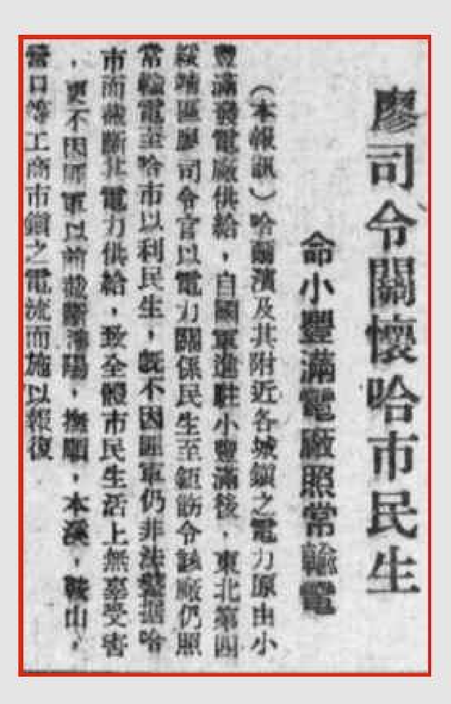

## 廖司令关怀哈市民生 令小丰满电厂照常输电

（本报讯）

哈尔滨及其附近各城镇之电力原由小丰满电厂供给，自匪军进驻小丰满后，东北第四绥靖区廖司令官以电力关系民生至钜饬令该厂仍照常输电至哈市以利民生，既不能因匪军仍非法盘踞哈市而截断其电力供给，致全体市民生活上无辜受害，更不能因匪军以前截断沈阳、抚顺、本溪、鞍山、营口等工商市镇之电流而施以报复。

> *<!-- 图源：佚名 -->*

> 前进报（长春）1946年06月18日第3版

