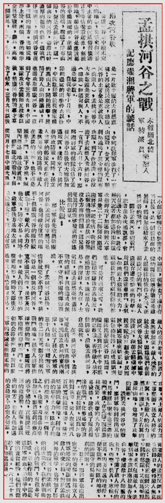

> *<!-- 图源：佚名 -->*

## 孟拱河谷之战——记廖耀湘将军的谈话

本报缅北随军特派员乐恕人

### 两次河谷战

胡康河谷是中缅未定决1的地带，从历史和河谷中土著的血统风俗习惯语言等等情况看起来，无疑问地，胡康河谷是应该属于中国版图的。在胡康河谷的南端，翻越了杰布山隘，便是孟拱河谷。这一个狭长的河谷，带着比较浓厚的缅甸色彩。但我们仔细研究，这个河谷有很多相似的地方。比如从地形上说，两个河谷的地形全异常复杂，丛林、高地、开阔地、峻山2、湖3沼，是一片最庄严的大自然环境：再就居民来说，胡康河谷的土著全是克钦族人（山头人），孟拱河谷中大多数还是克钦人，拢4夷（掸5族）和缅甸族人，不过是极少数。

自从去年十月底，中印缅边区的雨季停止以后，中国驻印军就从唐家铺的高山上，开始出击，展开了野人山的扫荡战，再进而攻取胡康河谷。一直到了今年三月九日，中国军队攻占孟关和瓦拉本以后，胡康河谷的战事才算告了结束。三月九日以后，中国驻印军进行了一回6山纵战，廿天的时光，顺利地通过了三十里的杰布山隘，到了沙拉渣，沙拉渣下去就进入孟拱河谷。一直到了六月十六日，廖耀湘将军的部队攻占了孟拱河谷中最后的大据点加迈城区。才结束了孟拱河谷的攻防战。同时，孙立人将军的部队又正在进行孟拱县城的攻防战，敌人在孟拱的抗争，也不过是困兽之斗，攻下孟拱，短期内很迅速地就会实现。

综观缅北的战局，自从四月十七日中国大军和一小部美军联合奋战密芝那7以后，是一个新局面的展开，因而加速结束了孟拱河谷的战斗。

关于孟拱河谷的战斗，记者在各次通讯里，曾经有过大致的介绍。最近几天记者在加迈四周8和这次指挥攻下加迈的新六军军长兼二十二师师长廖耀湘将军一起生活，我曾经请教过他关于孟拱河谷战役各方面的问题。这儿仅仅就目前能够发表的叙述出他的意见。

### 比较观：

廖将军首先指出胡康河谷和孟拱河谷虽然同是河谷，也同样有复杂的地形；但胡康河谷的面积纵横数十里，敌人的兵力分布太广，防守不易。同时，敌军离后方基地太远，补给线太长，地面没有空中补给，仅仅带了过去存储的粮秣弹药作战，这是敌人困难秣的条件。不过，在胡康河谷的战斗中，敌人还没有遭受惨痛的打击。所以他们还能集蓄9"士气" 和地面上炽旺的火力，顽强抗拒我们两个师的推进。

可是反过来说呢，我们驻印军离后方基地近，在补给方面，远较敌人容易。指挥好，火力强，士气旺。过去虽然毫无丛林战的经验，但也造成攻无不克，守无不固的辉煌战绩。

到了孟拱河谷以后，情形就完全不同了。孟拱河谷是一个狭长的河谷，宽不过三四里，长不及四十里。敌人利用了狭长的复杂地形，同时又离后方基地近，补给也较容易，敌人的兵力集中，防护力量无形加强。敌人所差的就是士气，因为他们在胡康河谷大龙河阻绝中国军队渡河，和在孟关歼灭中国军队的计划失败，反而被中国军队突破正面，赶过包围线路，演成狼狈突围逃出胡康河谷的局面，继而又遭到三十里卡拉班的追击战，弄得敌人站不住脚跟，溃进孟拱河谷，仓皇抵抗。

在孟拱河谷中，孟拱河从北到南，贯通整个河谷，因而孟拱河的东西两岸，就成了孙立人将军的三十八师，和廖耀湘将军的廿二师天然划分出来的战斗地境。孙立人将军指挥东岸的战斗，廖耀湘将军指挥西岸的战斗。这一带的公路在西岸，所以廖将军的部队是担任正面的攻击，遇上敌人的兵力强工事坚固。孙立人将军的左翼，遇上敌人的兵力自然比较薄弱，可是右翼的丛林山地，也增加了攻击的困难。

谈到孟拱河谷中的战斗，廖将军特别指出瓦康、马拉关和索卡道三处的战斗来讲。在瓦康，因为丛林茂密，攻击的火力不容发扬，敌我成了短兵相接的战斗，化整为零的战斗。在马拉关，因为河谷特别狭窄，敌人在东西八百码宽的纵深地带，构成坚强的阻击阵地，利用炮兵的集中火力，阻止了我们的推进，竟至有一个月之久。后来，因为兵力略为加强，廖将军利用优良的空中补给，实施深远迂回的截路战，在索卡迈以南的地方，把敌人通加迈的公路和小路完全切断，冒着敌人的猛烈反抗，扼守住路口，使得敌人无从撤退；让从正面钻穴过马闯10关的部队，又实施追赶11迂回，重重包围敌人，进击到索卡道以南拉加杏唐山谷，歼灭敌十八师团的主力，俘获了敌人所有的炮、弹药、装具、车辆、骡马，因而加迈的浅障12，便不能靠着13险阻的地形，维持固守的局面了。

最后，廖将军也指出密芝那的奇胜，和孙立人将军部队的切断加迈从而敌人的交通线，对于孟拱河谷的战争，也增加了胜利的因素。

胡康河谷和孟拱河谷的两次战役，我们的战斗，有很多可以成示范作用的。这是驻印军在血火的战争中得来的宝贵经验。他们贡献给了祖国。（六月二十日寄自加迈前线）

除7之外本文所有数字均表示原件此处难以辨认，该字词为编者根据字形及上下文推测而来。

7\. 即其他资料中提到的"密支那"。

> 录入：记不起原来的号了

> 1944年7月15日 昆明 中央日报
