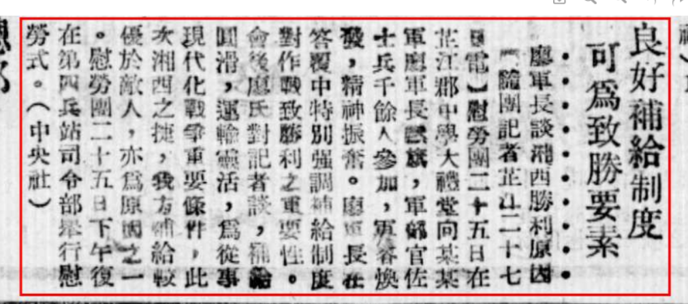

> *<!-- 图源：佚名 -->*

## 良好补给制度可为制胜要素　廖军长谈湘西胜利原因

【随团记者芷江二十七日电】慰劳团二十五日在芷江郡中学大礼堂向某某军廖军长献旗，军队官佐士兵千余人参加，军容焕发，精神振奋。廖军长在答复中特别强调补给制度对作战致胜利之重要性。会后廖氏对记者谈，补给圆滑，运输灵活，为从事现代化战争重要条件，此次湘西之捷，我方补给较优于敌人，亦为原因之一。慰劳团二十五日下午复在第四兵站司令部举行慰劳式。（中央社）

> 录入：记不起原来的号了

***日期存疑***

