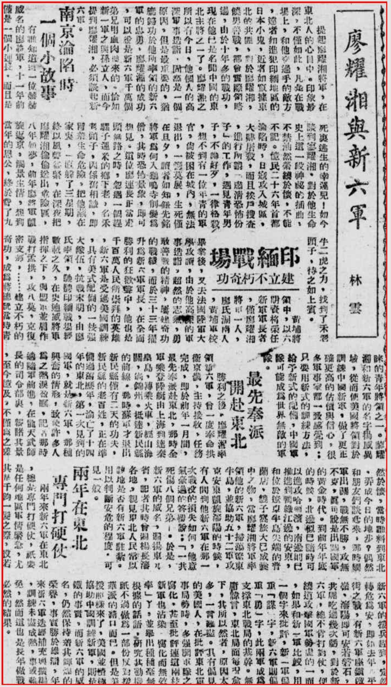

> 1948年6月10日 中央日报

> 校者注：小春秋晚报 1948-05-29 同载。新闻来源自《内幕消息》

提起廖耀湘将军，在东北人的心目中。印象最深，不仅如此，凡是在战场上，和他交过手的敌方,远者儒进犯印缅地区的日本小鬼，近者如窜据东北的共匪，对于廖耀湘，骁勇善战，都会实际领略过，由于十年多的战功，现在他已是名闻中国的东北主将之一了。廖耀湘之所以有今日，他个人的高深军事造诣，固然是一个原因，但是最重要的，犹应归功于他所率领的新六军的忠勇，廖耀湘的成功,可以说是新六军千万个弟兄用血肉换来的。恰如新一军之与孙立人，而今提到廖耀湘，必须谈起新六军。

## 南京沦陷时 一个小故事
有谁知道：一位赫赫威名的廖将军，十一年前仅是一个小连长，而且是死里逃生的幸运儿！如今谈到廖耀湘。对于他生命史上这一段神秘的插曲，不禁油然萦绕于怀，不能不记。忆民二十六年首都沦陷时，日寇攻入城区大肆屠杀，而且挨户搜查,进行所谓“肃清恐怖份子”的工作，遇见青年男子，不论好歹，一律格杀,想不到有一位年青的军官，被困在城内，无法退出，一筹莫展，生死仅在旦夕，读者如知钮先铭将军为何入呜寺削发为僧，其时恐怖景象，即可想见。这位廖连长正当走头无路之时，忽遇一个赶骡子运米的乡下老，名禾老头子，因系旧相识，即冒生命危险，把他藏在家里，一直躲了三星期，终以风声益紧，在深夜把廖耀湘偷偷送出危险区，八年如梦，前年廖将军凯旋返京，触景生情，想到当年的恩公，终于费了九牛二虎之力，找到了禾老头子，待之如上宾。

## 印缅战场建立不朽奇功
黄埔将领中，以六期资将荣任新军军长者,仅廖耀湘将军一人，廖氏湖南人,黄埔军校毕业后，又去法国陆军大学攻读，由于他高深的军事造诣，超然的志气，勇敢善战的精神，屡建奇功的战绩，而于三十三年擢升为新六军军长，在全面胜利的狂欢声中，他也是千百万人民所崇拜的英雄，新六军是受过美国训练,具有美式配备的一枝强大队伍，抗战末明，由廖氏领驰骋印缅战场经数载之久，在史迪威将军指挥之下，与盟军并肩作战打孟拱，攻八莫，克复密支那……建立不朽的奇功，成为蒋总统当时青睐的青年将领之一。廖耀湘和新六军的名字扬威异域，从而使美国将领对于训练中国新军，做了更正确更高的估价与信心，很多军事家都一致感觉到：只要用新式的训练方法，给予新式的配备，中国军队可能成为世界无敌的军队。

## 最先奉派 开赴东北
胜利之后，廖耀湘率领新六军，曾一度奉命拱卫京畿，主持接收，任务完成，即于前年一月间，最先奉派赴东北，那时全军乘登陆艇由上海到达秦皇岛，转乘火车，经山海关，过锦州，抵远新民县的前线。那时苏军才退出新民县仅有二天的功夫，新民县的老百姓，正在准备过旧历年，沦亡了十四年的东北，第一次见到的国军，就是新六军、那种兴奋的情形，致使许多人为之热泪盈眶。记者那时适随军前进，在龙天武师长的司令部裹，新睹其景,至今忆及，不仅为之差然于怀，当时谁料到东北弄成今日的地步？偶然和朋友们谈起来，那时国军出关，战无不胜，攻无不克，真可说是出关国军的黄金时代。到前年年底的时候，北边似已随时可以进攻哈尔滨，南边则已推进到鸭绿江边的安东，和位于辽东半岛尖端的普兰店、貔子窝旅大已成囊中之物，当廖耀湘将军率领他的新六军，扫荡辽东半岛，并协助五十二军攻克安东凯旋沈阳的时候，有人问到他新六军在那一次战役的损失如何，他意气豪迈的答复说：“一共死伤八个兄弟。”于是，新六军的威名，遍扬东九省，记者其时曾□杨长沈各地，亲见东北人民常以地是否有新六军驻札用以判断安危的程度。可见一般。

## 两年在东北 专门打硬仗
两年来新六年在东北，总是专门打硬仗，只要是任何地区军情紧急，尤其是千钧一发之际，倘若新六军的援兵赶到，定转危为安，即如去年四平街之战，有新六军座镇铁岭，沈阳即可安若盘石，共匪吃过几次亏，对于新六军，总不肯打对仗，便绕道攻击国军势虚的一面,如果和新一军比较，用一个字来批评，新一军偏重“谋”字，新六军则偏重“勇”字，此两军成为支撑东北战局的基干。无庸讳言。东北局面每况愈下，其所以然者，原因太多，一言难尽。具有偏见的美国人，在批东北军事局势时，多强调军队之腐化，甚至批评连这两枝新军也沾染腐化而无效率了，并举出种种毫无根据的话语。研究其动机，只不过做为一部份反对援华派的借口而巳。但是美援照样来了，美国并积极协助中国训练新军，则是铁的事实，而新六军的威名，仍然保持着其辉煌的荣誉，事实胜于雄辩，年来新六军迭经补充与扩编,训练未尽成热，事或难免，然而这也是长年作战必然的结果。

> *<!-- 图源：佚名 -->*

