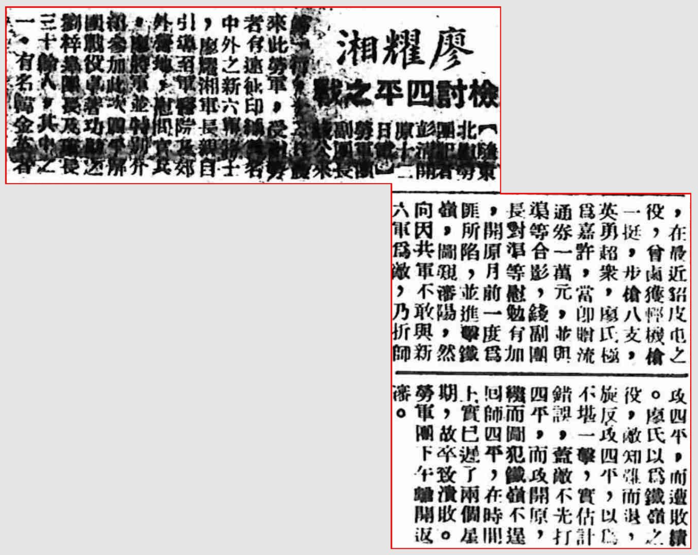

> *<!-- 图源：佚名 -->*

> 1947年7月13日 当代晚报

【随东北慰劳团记者彭清开原十二日电】劳军团副团长钱公来沈一行，特随二长官1来此劳军，受慰劳者有远征印缅闻名中外之新六军将士，廖耀湘军长亲自引导至军医院及郊外营地，慰问官兵。廖将军并特别介绍参加此次四平解围战役卓著功勋之刘梓皋团长及排长三十余人，其中之一，有名渠2金英者，在最近貂皮屯之役，曾虏获轻机枪一挺，步枪八支，英勇超众，廖氏极为嘉许，当即赠流通券一万元，并与渠等合影，钱副团长对渠等慰勉有加。开原月前一度为匪所陷，并进击铁岭，图窥沈阳，然向因共军不敢与新六军为敌，乃折师攻四平，而遭败。廖氏以为铁岭役，敌知难而退旋反攻四平，以不堪一击，实估错误，盖敌不先四平，而攻开原转而图犯铁岭不回师四平，在时上已迟了两个星期，故卒致溃败。劳军团下午离开沈。

*12因原文无法辨认据上下文推测而来。*

> *录入校对："记不起原来的号了"*
