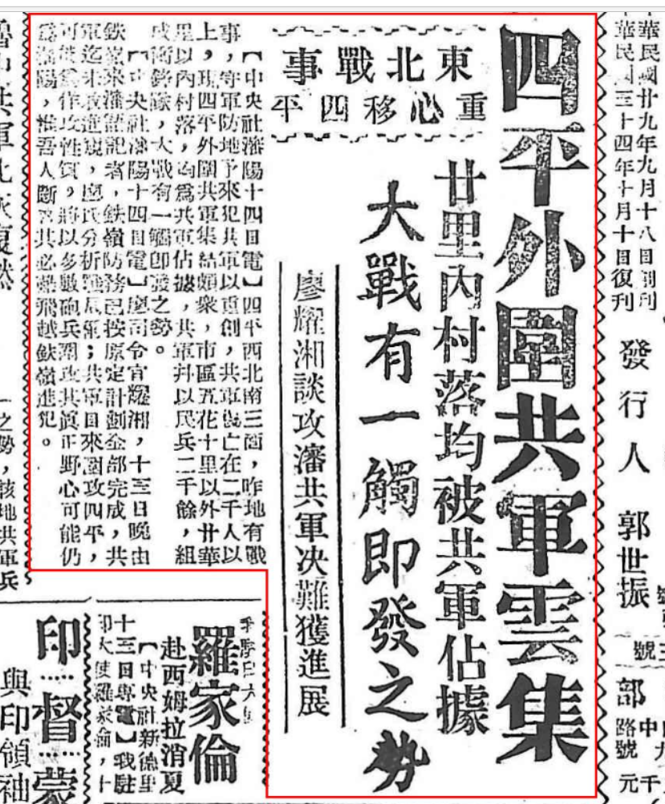

> *<!-- 图源：佚名 -->*

## 四平外围共军云集

### 东北战事重心移四平

#### 廿里内村落均被共军占据，大战有一触即发之势

#### 廖耀湘谈攻沈共军决难获进度

【中央社沈阳十四日电】四平西北南三面，昨地有战事，守军防地予来犯共军以重创，共军伤亡在二千人以上，现四平外围共军集结颇众，市区五花十里以外廿华里以内村落，均为共军占据，共军并以民兵二千余，组成冲锋队，大战有一触即发之势。

【中央社沈阳十四日电】廖司令官耀湘，十三日晚由铁岭来沈语记者，铁岭防务已按原定计划全部完成，共军迄未敢进窥。廖氏分析战局称：共军日来围攻四平，可能为佯攻性质，仅以多数炮兵围攻，其真正野心，可能仍为沈阳。惟吾人可断言其必不能飞跃铁岭进犯。

> 中华民国廿九年九月十八日创刊
> 中华民国三十四年十月十日复刊
> 发行人 郭世振

> *录入校对：记不起原来的号了*
