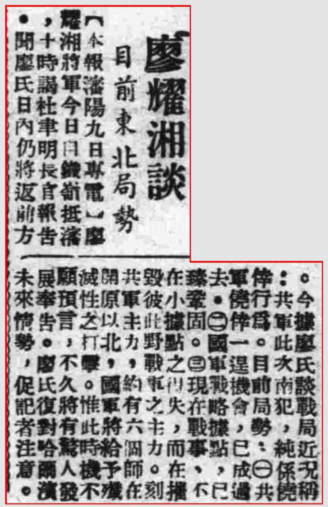

> *<!-- 图源：佚名 -->*

> 1947年6月10日 中央日报

【本报沈阳九日专电】廖耀湘将军今日自铁岭抵沈，十时谒杜聿明长官报告。闻廖氏日内仍将返前方。今据廖氏谈战局近况称：共军此次南犯，纯系侥幸行为。目前局势：①共军侥幸一逞机会，已成过去。②国军战略据点，已臻巩固。③现在战事，不在小据点之得失，而在摧毁彼此野战军之主力。刻共军主力，约有六个师在开原以北，国军将给予歼灭性之打击。惟此时机不愿预言，不久将有惊人发展奉告。廖氏复对哈尔滨未来情势，促记者注意。

> *录入校对：记不起原来的号了*
