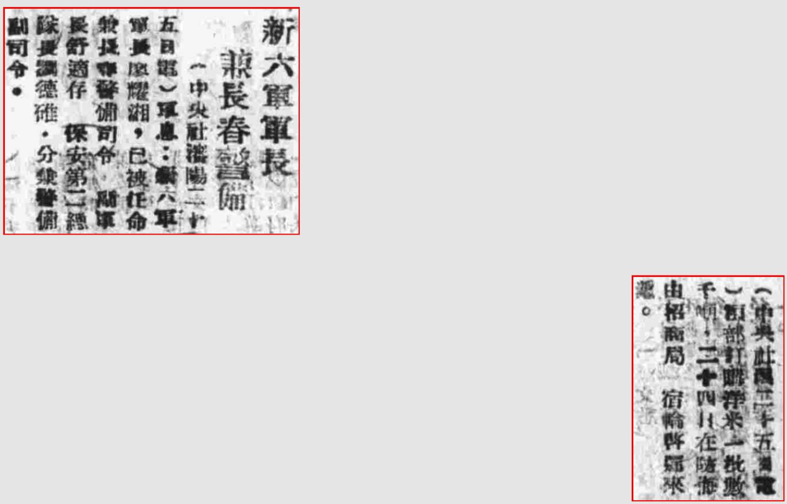

> *<!-- 图源：佚名 -->*

> 1946年5月27日 健康日报

（中央社沈阳二十五日电）军息：新六军军长廖耀湘，已被任命兼长春警备司令。副军长舒适存、保安第二总队长刘德溥1，分兼警备副司令。

（中央社二十五日电）粮部认购洋米一批数千吨，二十四日在防海由招商局一宿轮启归来港。

*1原文三字有印刷错误，根据其他资料确认此处应为刘德溥。*

> *录入校对："记不起原来的号了"*
