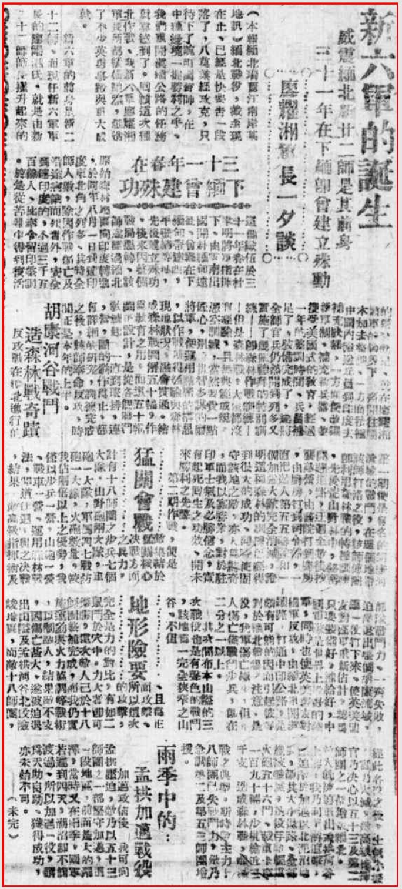
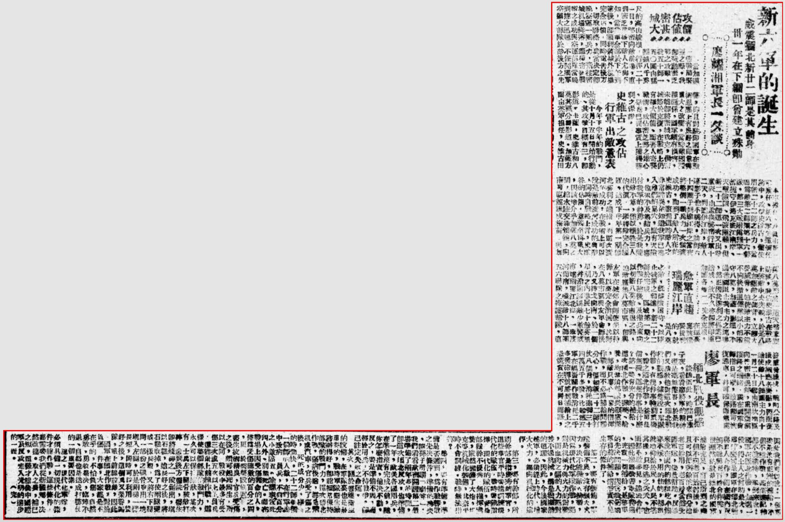

* TOC
{:toc}

新六军的诞生——威震缅北新廿二军是其前身，三十一年在下缅即曾建立殊勋

廖耀湘军长一夕谈

（本报缅北瑞丽江南岸某地讯）缅北战役，截至现在止，已经是快要告一段落了，八莫业经攻克，只待下了畹町【国管】师，在中缅边境一握胜利之手，我们重开滇缅公路的任务就算达到了。回顾这次缅北作战，我新六军廖耀湘军长所部纵横驰骋，缔造了不少英勇事迹与重大成就。

新六军的前身是新二十二师，而现任新六军军长的廖耀湘氏，就是由新二十二师师长所擢升起来的。

### 三十一年春在下缅曾建殊功

这个队伍于三十一年春在杜聿明将军指挥下，由云南出国开赴缅甸远征，曾经在下缅甸带【远西】、【平蛮缅】等地，先后建立殊功。后来因整个战局恶转，该师曾经过缅北原始森林山区向印度转进广东北角之列多，其时全师人数，除因作战伤亡及沿途病饿而死者外，安全到达印度的，不过三千五百余人，即率留印整调，于是从苦难中得到复活的留印国军就在廖耀湘将军的率领下，一齐开往兰木加去整训，一方面由中国内输送兵员到印度去补充缺额，一方面便于弥补军制，补充新兵器，整编受美国式的教育。经过一年的整训时间，兵员补足了，战备完成了。遂将全师官兵仍然开到列多又实施了数个礼拜的特别训练——即森林作战训练——但是森林战大家都没有经验，且无典范成规，凭空训练，当然要费一点匠心，于是足智多谋的廖将军，便运用精密的构思，以作战所得经验与森林现地状况，融会贯通。绘成森林战图解五十编，作为教育之用。而这五十编图中设计，是从各种战斗训练起，一直到班、排、连、营、团的动作为止，都有详细的研究，训练完成之后，该师奉命反攻，时间正是本年的上半。

### 胡康河谷战斗，造森林战奇迹

反攻战在缅北进行的第一期便是有名的胡康河【流域】的战斗，在这个地带，该师打洛之役，该师阵间即利用树林丛的【帱帷】训练，先后荒山野林中，务密开通进路，迂回全军后抄袭敌营，由医院打到厨房，由厨房打到司令部，一直把敌人第五五部队和一个加强大队完全消灭，证明这个森林的训练已经得到很大的成功。同时能固守该地之敌，亦人【所】惊奇，而我以寡胜众，对于驻印军士气及必胜信念，实有起死回生之功效，开未来胜利之先声。

### 猛关会战

第二期作战，便是敌集结于猛关核心决战方面，计有十八师团之步兵七个大队、山野炮两大队、车炮一大队、军伪四七战防炮一大队，火炮数量，较我占两倍以上之优势，我谨以步兵一营、山炮一营、战车一营、运用森林战法，单道迂回，与之决战，结果，敌高级指挥术及部队战斗力，一齐失败，迫敌退出整个胡康流域。这一仗打下来，使英美盟友对缅军重新估计，认为只要装备好，补给好，中国军队即是世界上极好的国军；同时也【便】英美盟友对缅军反攻，由缅北军开辟网路，打通中印公路，是颇有可能的，因而引起彼等对于缅北【战场的】注意，是设，我军伤亡极少，但敌人伤亡仅战斗步兵，即在二分之一以上。

### 地形险要

其次间布本山隘的三次战役也是有声色的战斗，该地为一完全狭窄之山谷，不但、且为正面攻击，所以这次的攻击，完全是力的对比，有如二鼠斗于穴中。力大者即可获胜，还次敌人已于十八师团整补完成，而我仍实施运动与火力协调等战术，以制敌人，结果敌不支，因伤亡甚大，遂被迫退出山隘及孟拱河谷，北投险峻地区，而敌十八师团经次各役之后，士气受扰，实力大减。敌高级指挥官乃决心以五十三及第二师团之一帮增兵缅北。敌人既派连兵出孟拱河谷上游，我乃利下游追击，遂迫敌于加迈以北泥沼地带，敌其大失退路，全部陆续歼灭，此役俘敌轻型火炮五十六门，战车卡车一百九十辆，步机枪近三千支，造成森林战歼灭敌之典型。斯时敌主力十八师团已失战斗力，敌乃急调第二及第五三师团增援。

### 雨季中的孟拱加迈战役

加迈攻备后，就可向孟拱压迫，敌乃以五十三师团之一部坚守加迈，这一段地区，前面广大的沼泽，当时又在雨季，国军若迟到四天，湖沼即不能渡过，所以加迈一役，谓为天助良助，获得成功，亦未始不可。

### 攻占密城价值甚大

当加迈一带战局紧张之际，我即发动密芝那之攻击，我五十师一五〇团由猛关越八千英尺的高山峻岭，行经二十一日，秘密向敌前进，直到密支那城下。敌人尤尚不知，当我军全部于下午到密后，即顺利将城外机场完全占领，同时电告后方，切取联络，我当决定即晚空运一团兵力，飞往密城机场降落，这种迁袭战击之成功与空运部队当晚到达之迅速，不仅开国军空运大部队于敌后方之先声，即且对驻印国军在战术思想上有良好之印象与重大之改变。当时业因【粮秣】关系，国军颇有损害，未能即将密城攻克，待密城终于克复，在战略上仍有极大价值，而吾人奇袭战术，攻占密芝那之雄心，毕竟已从事实上获得胜利之保证。

### 史维古之攻占，行军出敌意表

今年下半年的战斗，是从十月十五日开始行动的，其攻击目标有三，即影道、【卡关】、史维古和八莫其区分。影道—加萨方面由英军担任，史维古由【本军拨兵、派出新六军】承任。新六军在这个任务中，攻夺史维古，仅使用新二十二师之兵力，当面夺敌第二师团第十六部队。第三大队附属缅军一部扼守伊洛瓦底江两岸，天堑险阻，飞渡【舸摇】，但新二十二师这一次又出敌意表，由孟拱秘密行军十二天，到达伊江岸，敌人连影子也不晓得。该师六十四团于到达江岸之当夜将整个一团兵力一次强渡成功，而到了敌人所在的史维古，直到这时敌人才非常诧异的知道我军已进入他们的巢穴，纵有天险，也来不及集结兵力，应付我军的神勇，于是我遂出敌不意，仅以牺牲三人的代价，一举将敌完全歼灭，造成下半年第一期缅北胜利之端绪。而这次渡河的成功，在战术上可以说是敌前渡河成功的典型，同时自战略上言，史维古的占领，意义至为重大，因该地介乎加迈八莫之间，绾水陆交通运输，向南可直趋腊戍梅苗，与加迈八莫形成一道天然巩固防线，我占史维古在战略上将敌中央突破，于是八莫加迈敌之侧背，立即大受威胁，迫使敌主力不能不向后撤退殆毕以小部困守八莫、加迈、影道，不过希望阻止我主力之迈进，然而因我胜利之机业已造成，故不久亦即将印道加萨各地一一完全克服。

### 急军直趋瑞丽江岸

在这里应该还要提到的，就是八莫之敌，既据险困守、以阻止我军之前进，新二十二师于完成此区域第一期之作战任务后，及指兵东向以切断八莫敌南退之路，迫敌群集八莫市区，即与友军在城郊会师使坐以待毙，以至完全消灭，该师在八莫市区与友军会师后，乃又挥戈向南，于一个星期之内进展七十余英里，并沿途袭退敌少数警戒直趋瑞丽江北岸，一举渡河而南，歼灭敌十八师团五六联队之掩护部队，直【发感骨边境】，畹町公路及腊戍缅北各要点，因而后迫使敌十八师团主力自十一月二十日起由南坎辖区向芒密总退却，重开滇缅公路之网络，现在国军会师指日可待，该路即可恢复通车，并可确保车无虞。

### 廖军长缅北战役观感

谈话至此，时间已经子夜，看看廖将军的精神，还是毫无倦容，于是我们又请教他对这次缅北战役的观感。据他说：军队作战，有几件事特别重要，观之缅北作战，益可确信无疑，这几件事是什么？第一要有充分的补给、这次缅北作战，弹药、给养，均接济部队长【期虑乐】，部队只要一心一意的指挥作战，而不必为补给问题分心，例如新二十二师打仗八个月，消耗炮弹三十四万五千多发，比起新五军在昆仑关作战消耗二千多发炮弹就感到补给上之恐慌实在不可同日而语。因此我们可以说：一个军队要是没有正确的补给，不但不能作战，甚至连纪律都不能维持，举例来说：国军在缅北作战，加迈一役，得土人之帮助最大，为什么同是国军在缅北能与土人合作，而在国内时倒不能与老百姓合作呢？很显然的就是缅北的国军补给充足，自己所到之处不但不向老百姓讨扰，而且可以把剩余的东西分给老百姓用，老百姓当然爱护军队，优先帮助，反过来说在国内的部队吃不饱穿不暖，用的住的，都为就地仰给于民，人民不堪其扰，只好逃之夭夭，连面都不敢多见，还云合作，因此关切改善军队待遇，充实一切补给，是我军的先决问题，因为我国国军目前的补给情形实不足生存的条件了。

第二，要有装备，军队装备不良，没有扩大火力，决不能与敌人作战，因为现代化军队作战，绝对是机械力与火力的对战，而血肉之躯的人力绝对较不过机械，最是很自然的道理，因此，今后国家建军，必须赶上时代，增大火力，赶向机械化的建设。

第三，要有干部，所指干部是极优秀的军官，这些军官平时要能训练现代化的队伍，战时要能指挥现代化的队伍，如果部队干部不优秀，无指挥素养，纵然装备了大炮、坦克等机械化装备，其奈平时不会训练，战时无法指挥？

第四，要有准备。准备是否迟到，为作战胜败之先决条件，准备的功夫，即孙子所谓"庙筹"。我们看看欧洲开辟第二战场准备了两年多的时间，即这次缅北反攻，也准备了一年，欧美各国用兵，在准备没有完成之前，随你怎么指责，他决不动。反之，要是准备【不成】，而轻于用兵，不待战争，即已注定失败之命运。

其次，关于医药卫生的设备，在军队里也是最重要的，战时军队卫生运动办得好，即能经常部队的战斗力，这次缅北作战，伤病后送，都是飞机或汽车，官兵受了伤之后，死的成分少，恢复的时间快。二十二师总共一个师的人数，在行军途中致病员兵，不到百分之小数点五，除翻车致死四人外，别无死亡。而在战场上因受伤毙命的人，仅为受伤总数的百分之四，更出于医药设备过人，医生技术精良，官兵受伤之后，颇可起死回生，所以在问战役中最多有受伤三次或五次以上员兵，还能重上前线作战，这样使整个部队的战斗力，永久可以保持原状，某次有一士兵左下腿骨被敌打碎，送到后方医院，医生即将残碎之一段锯出，填以石糕，这长好之后，将石糕取掉，为了使两腿变成一样长短，又将右下腿同一部分之腿骨取出一块填入左腿，于是两腿一样长短，同时可以利用，养好之后，这个兵又荣誉归队，重上前线杀敌。因此，国军在缅北作战，对于负伤这件事，大家都是不在乎的，不怕负伤，自然勇敢，勇敢果决，临阵不退，自然也是造成打胜仗的一个重要因素。

总之，现代化军队，必须具备一切现代化的条件才能作战，这些条件，都需要我们从新体验，决然改造。取人之长，补己之短，这样才能【俟】中国建军及反攻，走入光明的进步的一面。

> *校对者注：因原文多处模糊，【】其中文字及词组都为校对人根据原文图片字形以及上下文推测而来。*

> *录入校对：记不起原来的号了*

> *<!-- 图源：佚名 -->*

> 来源：扫荡报
