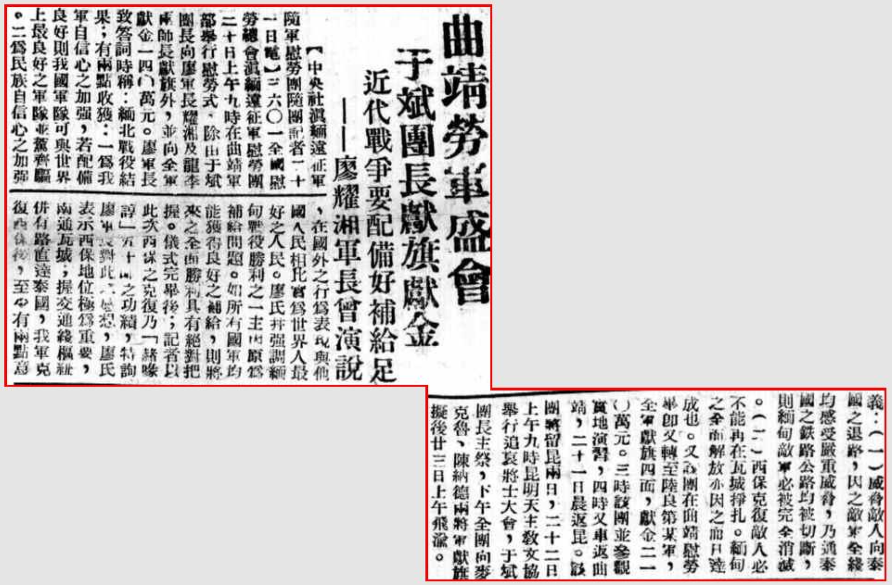

> *<!-- 图源：佚名 -->*

## 曲靖劳军盛会 于斌团长献旗献金

### “近代战争要配备好补给足”——廖耀湘军长曾演说

【中央社滇缅远征军随军慰劳团随团记者一十一日电】六〇一全国慰劳总会滇缅远征军慰劳团二十日上午九时在曲靖军部举行慰劳式。除由于斌团长向廖军长耀湘及龙李两师长献旗外，并向全军献金一四〇万元。廖军长致答词时称：“缅北战役结果有两点收获：一为我军自信心之加强，若配备良好则我国军队可与世界上最良好之军队并驾齐驱。二为民族自信心之加强，在国外之行为表现与他国人民相比实为世界人最好之人民。廖氏并强调缅甸战役胜利之一主因为补给问题。如所有国军均能获得良好之补给，则将来之全面胜利具有绝对把握。仪式完毕后，记者以此次西保之克复乃职部新1五十师之功绩，特询廖军长对此之感想，廖氏表示西保地位极为重要，南通瓦城，握交通线枢纽并有路直达泰国，我军克复西保后，至少有两点意义：（一）威胁敌人向泰国之退路，因之敌军全线均感受严重威胁，乃通泰国之铁路公路均被切断，则缅甸敌军必被完全消灭。（二）西保克复敌人必不能再在瓦城挣扎。缅甸之全面解放亦因之而可达成也。又该团在曲靖慰劳毕即又转至陆良第某军，全军献旗四面，献金二一〇万元。三时该团并参观实地演习，四时又车返曲靖，二十一日晨返昆。该团将留昆两日，二十二日上午九时昆明天主教文协举行追哀将士大会，于斌团长主祭，下午全团向麦克鲁、陈纳德两将军献旗，拟后廿三日上午飞渝。”

1. 原文此处为“赭喙谆”，应是“职部新”三字电子化识别过程中产生的谬误，特更正。

> 录入：记不起原来的号了

> 1945年3月25日 新疆日报
