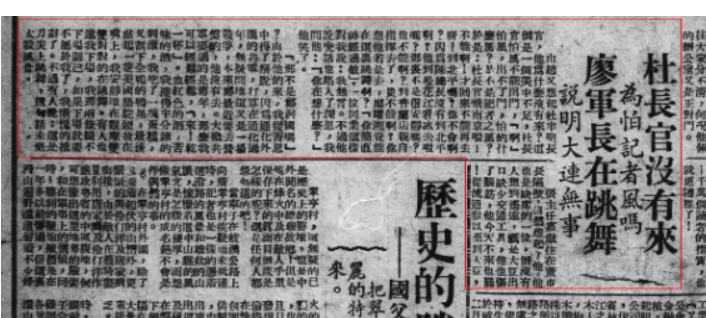

> 新民报 1947.01.02

由赵又想起杜聿明长官，他为什么没有来？这倒是一个美中不足，杜长官怕风不能出门，“啊”怕风，出不了门，怕的是什么风？是不是记者之风？于是：杜长官飞南京啦！不能啊！才回来不能再去呀！到北平吗？也不会啊？因为陈总长没有到北平啊？他到松花江看冰去啦吗？那里不是很安静吗？也不能啊？到普兰店亲自指挥去了，更不能啊？想他若是去，廖耀湘岂能在这里跳舞啊？“你简直过敏。”一位同业这样对我说：我无言。不过他说完话也陷入了深思，我问他：“你在想什么？”他笑了。

“那不是郑洞国吗?”由于他的来，我从苦思中得了解脱，因为通化外围的共军，打算在通化过年，无疑问地这又是一场战争，本来郑最近要去营盘的，他没有去。大概大概共军要过的是旧年，那么我可以轻松轻松，“来！干一杯。”血红色的酒，苦味的酒，我获得半分钟的刺激，我吃了一块蛋糕，又割下全鸭的鸭尾，最后点起一只美国骆驼烟放在嘴上，我安静地在观摩双双对对的在跳舞。有人也邀我下场，我那两条腿不下场则己，如果下场就要不属于我了，我惭愧的推辞了。不过有人说：这是刀尖上跳舞，这句话未免太煞风景。

张主任嘉傲住在董市长隔壁，自然想起了他，他也是缺席的一位，倒没有人想到遥远，只是大豆出口缺少交通工具，他也伤了脑筋，他今天不来也罢!从流通券以至到大豆，东北的人们都切盼他多打算盘，多活一条命，功德无量，张主任就叫人印象更深远了！

夜阴寒，从寒冷中来的，又回向寒冷。

> *录入校对：鱼珠前航道舵手*

> *<!-- 图源：佚名 -->*

***日期存疑***
