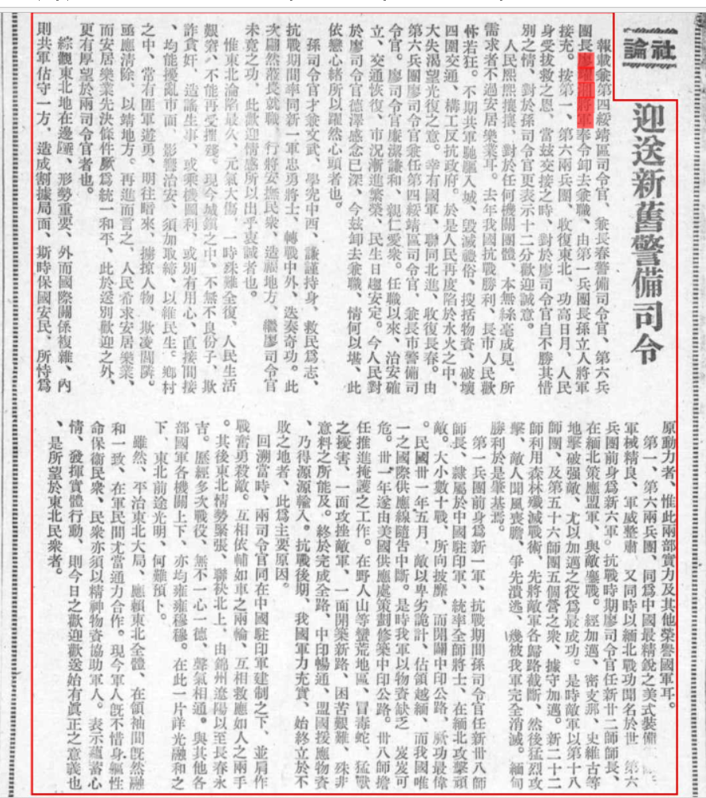

> *<!-- 图源：佚名 -->*

## 社论　迎送新旧警备司令

报载兼第四绥靖区司令官、兼长春警备司令官、第六兵团长廖耀湘将军奉令卸去兼职，由第一兵团长孙立人将军接充。按第一、第六两兵团，收复东北、功高日月，人民身受拔救之恩，当兹交接之时，对于廖司令官自不胜其惜别之情，对于孙司令官更表示十二分欢迎诚意。

人民熙熙攘攘，对于任何机关团体，本无丝毫成见，所需求者不过安居乐业耳。去年我国抗战胜利，长市人民欢忭1若狂。不期共军驰驱入城，毁灭礼俗、搜刮物资、破坏四周交通，构工反抗政府。于是人民再度陷于水火之中，大失渴望光复之意。幸有国军，连同北进，收复长春。由第六兵团廖司令官兼任第四绥靖区司令官，兼长市警备司令官。廖司令官廉洁谦和、亲仁爱众。任职以来，治安确立、交通恢复、市况渐进繁荣，民生日趋安定。令人民对于廖司令官德泽感念已深，今兹卸去兼职，情何以堪，此依恋心绪所以跃然心头者也。

孙司令官才兼文武、学究中西、谦谨持身、救民为志，抗战期间率同新一军忠勇将士，转战中外，迭奏奇功。此次翩然莅长就职，行将安抚民众，造福地方，继续廖司令官未竟之功，此欢迎情感所以出乎衷诚者也。

惟东北沦陷最久、元气大伤，一时殊难全复，人民生活艰窘，不能再受摧残。现今城镇之中，不无不良分子，欺诈贪奸、造谣生事、或乘机图利、或别有用心，直接间接，均能扰乱市面、影响治安，须加取缔，以维民生。乡村之中，常有匪军游勇，明往暗来、掳掠人物、欺凌闾邻。亟应清除、以靖地方。再进而言之，人民希求安居乐业，而安居乐业先决条件厥为统一和平，此于送别欢迎之外，更有厚望于两司令官者也。

综观东北地在边陲，形势重要，外而国际关系复杂，内则共军占守一方，造成割据局面，斯时保国安民，所恃为原动力者，惟此两部实力及其他荣誉国军耳。

第一、第六两兵团，同为中国最精锐之美式装备军队。军械精良、军威整肃，又同时以缅北战功闻名于世。第六兵团前身为新六军。抗战时期廖司令官任新廿二师师长，在缅北策应盟军，与敌鏖战。经加迈、密支那、史维古等地击破强敌，尤以加迈之役为最成功。是时敌军以第十八师团、及第五十六师团五个营之众，据守加迈。新二十二师利用森林歼灭战术，先将敌军各归路截断，然后猛烈攻击，敌人闻风丧胆，争先溃逃，几被我军完全消灭。缅甸胜利于是肇基焉。

第一兵团前身为新一军，抗战期间孙司令官任新卅八师师长，隶属于中国驻印军，统率全师将士，在缅北攻击顽敌。大小数十战，所向披靡，而开辟中印公路，厥功最伟。民国卅一年五月，敌以卑劣诡计，占领越缅，而我国唯一之国际供应线随告中断。是时我军以物资缺乏，岌岌可危。卅一年遂由美国供应处策划修筑中印公路。卅八师担任推进掩护之工作。在野人山等蛮荒地区，冒毒蛇、猛兽之扰害，一面攻挫敌军，一面开筑新路，困苦艰难、殊非意料之所能及。终于完成全路，中印畅通，盟国援应物资乃得源源输入。抗战后期，我国军力充实、始终立于不败之地者，此为主要原因。

回溯当时，两司令官同在中国驻印军建制下，并肩作战奋勇杀敌。互相依辅如车之两轮，互相救应如人之两手。其后东北情势紧张，联袂北上，由锦州辽阳以至长春永吉。历经多次战役，无不一心一德，声气相通。与其他各部国军各机关上下，亦均雍雍穆穆。在此一片祥光融和之下，东北前途光明，何难预卜。

虽然，平治东北大局，应赖东北全体，在领袖间既然融和一致，在军民间尤当通力合作。现今军人既不惜身躯性命保卫民众，民众亦须以精神物资协助军人。表示蕴蓄心情，发挥实体行动，则今日之欢迎欢送始有真正之意义也，是所望于东北民众者。

1. 忭：biàn，欢喜

> 录入：记不起原来的号了

***日期存疑***
